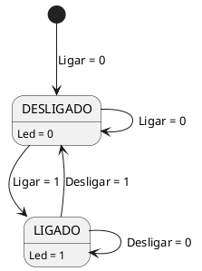

### Partes
- **Estados**: DESLIGADO, LIGADO
- **Transições**: DESLIGADO para LIGADO e LIGADO para DESLIGADO
- **Entradas**: Ligar, Desligar, Resete, clock
- **Saídas**: Led

### Tabela de transição de estados

| Estado atual | Entrada | Próximo estado | Saída |
| ------------ | ------- | -------------- | ----- |
| DESLIGADO | Ligar = 1 | LIGADO | Led = 1 |
| LIGADO | Desligar = 1 | DESLIGADO | Led = 0 |
| LIGADO | Ligar = 1 | LIGADO | Led = 1 |
| DESLIGADO | Desligar = 1 | DESLIGADO | Led = 0 |

### Diagrama de estados
