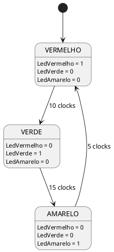

### Partes

- **Estados**: VERMELHO, VERDE, AMARELO
- **Transições**:
    - VERMELHO &rarr; VERDE
    - VERDE &rarr; AMARELO
    - AMARELO &rarr; VERMELHO
- **Entradas**: clk, rst
- **Saída**: LedVermelho, LedVerde, LedAmarelo

### Tabela de transição

| Estado atual | Entrada | Próximo estado | Saida |
| ------------ | ------- | -------------- | ----- |
| VERMELHO | 10 clocks | VERDE | LedVerde = 1 |
| Verde | 15 clocks | AMARELO | LedAmarelo = 1 |
| AMARELO | 5 clocks | VERMELHO | LedVermelho = 1|

### Diagrama de estados
